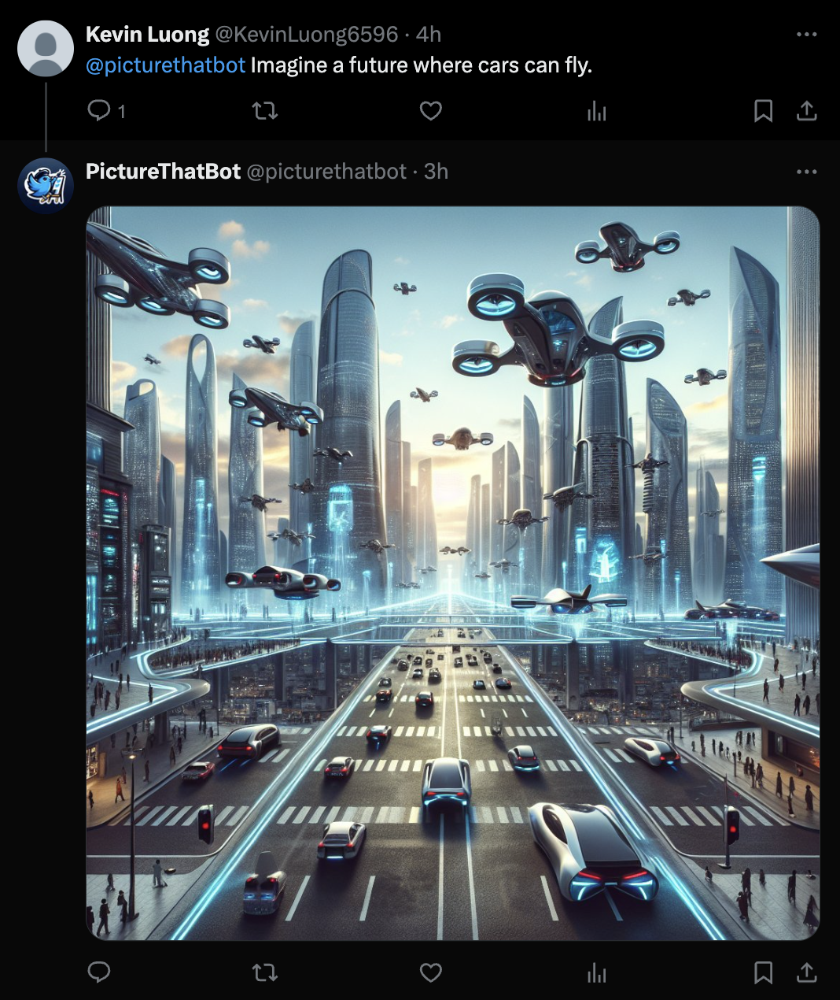
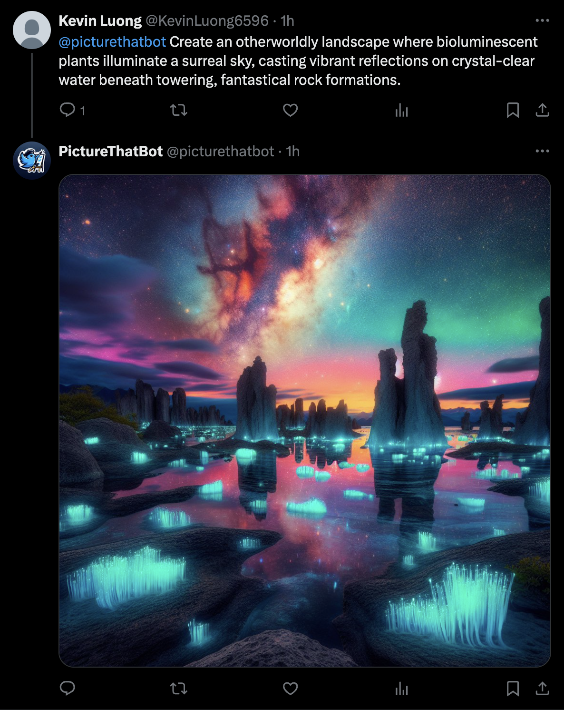
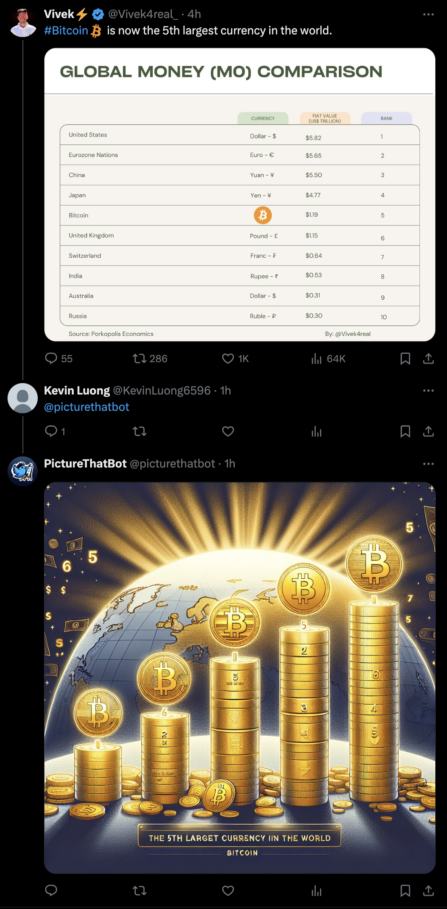
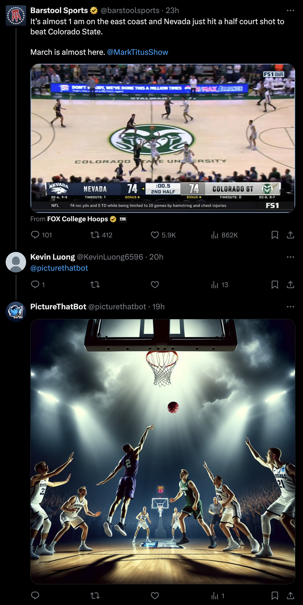

# PictureThatBot - AI-Powered Twitter Image Generator

Welcome to PictureThatBot, your personal Twitter artist! 🎨 Mention @picturethatbot in your tweet or under a tweet you want to see as an image, and watch as it responds with a unique image generated by OpenAI's powerful algorithms, tailored to the content of your message. Embrace the creative collaboration between humans and AI in the world of social media! 🚀

    
    

    
    

### Built With

1. Python
2. AWS Lambda
3. Twitter/X APIs

## How to Use

1. Mention @picturethatbot in your tweet or reply to a tweet you want to see as an image.
2. Await the artistic response generated just for you!

## Features

- __Instant Image Generation__

<blockquote>
Experience the magic as PictureThatBot transforms your tweets into visual masterpieces on the fly using the power of OpenAI.
</blockquote>

- __Twitter Integration__

<blockquote>
Seamlessly integrated with Twitter to bring AI-generated images directly to your mentions.
</blockquote>
 
- __Scheduled Perfection__
 
<blockquote>
Thanks to AWS Lambda, PictureThatBot runs like clockwork, generating artistic responses every 10 minutes.
</blockquote>

## Contributing

If you have a suggestion that would make this better, please fork the repo and create a pull request. You can also simply open an issue with the tag "enhancement". Don't forget to give the project a star! Thanks again!

1. Fork the Project
2. Create your Feature Branch (`git checkout -b feature/AmazingFeature`)
3. Commit your Changes (`git commit -m 'Add some AmazingFeature'`)
4. Push to the Branch (`git push origin feature/AmazingFeature`)
5. Open a Pull Request
